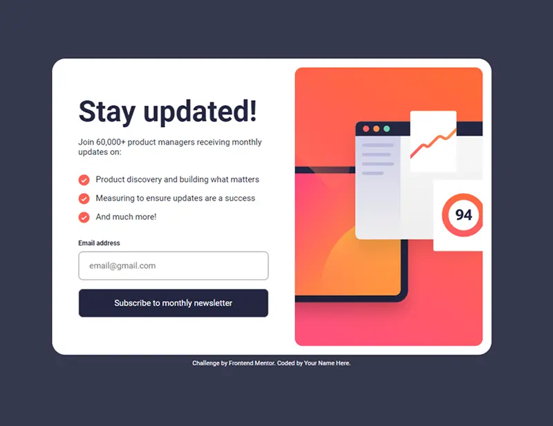

# Frontend Mentor - Newsletter sign-up form with success message

Este es un proyecto realizado como parte de los desafíos de [Frontend Mentor](https://www.frontendmentor.io). El objetivo es construir un formulario de registro interactivo que valide los datos del usuario y muestre una confirmación tras un envío exitoso.

## Tabla de contenidos

- [Vista general](#vista-general)
  - [Captura de pantalla](#captura-de-pantalla)
  - [Enlaces](#enlaces)
  - [El desafío](#el-desafío)
- [Mi proceso](#mi-proceso)
  - [Construido con](#construido-con)
  - [Qué he aprendido](#qué-he-aprendido)
- [Autor](#autor)

---

## Vista general

### El desafío

Los usuarios deben poder:

- Ver el formulario óptimo según el tamaño de pantalla de su dispositivo (Mobile/Desktop).
- Ver estados de `hover` e interactividad en los elementos (botones).
- Recibir un mensaje de error si:
  - El campo de correo electrónico está vacío.
  - La dirección de correo electrónico no tiene el formato correcto.
- Ver la tarjeta de éxito tras un envío exitoso.

### Captura de pantalla

### Enlaces

- [URL del repositorio en GitHub](https://github.com/amateusouto/Newsletter-sign-up-challenge-from-FrontEnd-Mentor)
- [URL de la demo en vivo](https://tu-usuario.github.io/tu-repositorio/)

---

## Mi proceso

### Construido con

- Marcado HTML5 semántico.
- CSS (Propiedades personalizadas, Flexbox, Media Queries).
- JavaScript (Vanilla JS).
- Enfoque *Mobile-first*.

### Qué he aprendido

En este desafío he profundizado en:

1. **Gestión de validaciones:** Aprendí a combinar la semántica del input (`type="email"`) con el atributo `novalidate` en el formulario, delegando el control total de la validación a JavaScript.
2. **Manipulación dinámica del DOM:** Uso de `classList` (`add`, `remove`) para aplicar estados visuales. Aprendí a inyectar clases dinámicamente desde JavaScript para controlar el estilo del formulario de forma declarativa, evitando tener que manipular propiedades de estilo (`style.display`) directamente desde el script. Esto permite mantener una separación de responsabilidades mucho más limpia entre CSS y JS.
3. **Control de flujo:** Cómo gestionar la visibilidad de diferentes secciones (`display: none` / `flex`) para crear una experiencia de "página única" sin recargas.

---

## Autor

- Frontend Mentor - [@TuUsuario](https://www.frontendmentor.io/profile/amateusouto)
- GitHub - [@TuUsuario](https://github.com/amateusouto)